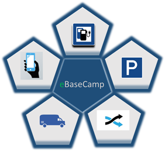

**Courier-, Express- & Parcel-providers (CEP-Providers) play an evermore important role in the daily lives of many people. To
guarantee timely deliveries and customer satisfaction, these providers rely on sophisticated algorithms to manage the disposition of their
fleets. In the course of the eBaseCamp-project, Eclipse MOSAIC has been utilized and extended to model a delivery service leveraged by
e-mobility and a Base Camp infrastructure.**



The aim of the research project [eBaseCamp](https://www.digitale-technologien.de/DT/Redaktion/DE/Standardartikel/IKT-EM/IKT-Projekte/ikt-III-projekt-eBaseCamp.html) was to replace the emission- and fuel-hungry Diesel fleets of CEP-providers with
clean emissionless electric vehicles and evaluate the economical and ecological impact.
To achieve this goal a Base Camp infrastructure is proposed, providing parking spaces, charging spots, and further facilities for electric fleets.
To measure potential emission and fuel savings, an entire day of deliveries in Berlin was modeled,
complete with realistic background traffic, and configurable delivery positions & fleet sizes.
In a first step the logistic applications were developed and tested on an excerpt of the map covering Charlottenburg (district of Berlin).



Utilizing **Eclipse MOSAIC**s Application Simulator a system has been developed, that allows for remote tour planning and vehicle routing 
requests.
This system enables drivers to request new deliveries on demand while not having to worry about finding the fastest routes themselves.
On the server-side state-of-the-art libraries are used to solve Shortest Path and the Vehicle Routing Problem (VRP) to provide drivers with optimal tours.

### The Simulation Setup
**Infrastructure**

Initially, the infrastructure for the Base Camps and delivery bases had to be modeled.
We extended the road network with SUMO parking areas as shown in the picture below, which allows for variable locations
and easy integration with **Eclipse MOSAIC**.
For each parking spot in the Base Camp a Charging Spot was configured using the [Charging Simulator (MOSAIC Extended)](/docs/simulators/emobility_simulator_charging), which delivery vehicles can dock on to.



**Day Plans**

In a second step we analyzed the typical day plans of delivery drivers and evaluated how these will change with
the integration of a Base Camp Infrastructure (see image below).
Additionally, we developed a tool which uniformly distributes Delivery Stops with variable times in configured areas.
Together with configurable timings for loading and unloading and variable starting hours, the general evaluation setup was ready.



**Battery Simulator**

In order to achieve convincing results for the energy demand of electronic vehicles we revamped the 
[Battery Simulator (MOSAIC Extended)](/docs/simulators/emobility_simulator_battery), introducing a new WLTC-validated
Lithium-Ion Battery Model and capabilities for DC-Charging.
Furthermore, we realistically modeled the Mercedes eSprinter for the **Battery Simulator** to run the simulations with.



[1] Han, Wang, Filev. „Optimized Design of Multi-Speed Transmissions for Battery Electric Vehicles”, 2019

**Touring**

Finally, with all prerequisites fulfilled implementation of the **ITS**-Application could begin. 
Vehicles will programmatically follow their day plans, with delivery stops and routes being requested from a remote server,
once the previous delivery is finished. This allows the Touring-Server to intelligently plan the execution of all existing stops.
Algorithmically this means that the Vehicle Routing Problem (VRP) has to be solved. The Server-Application has bindings for
the state-of-the-art libraries [jsprit](https://jsprit.github.io/) and [OR-Tools](https://developers.google.com/optimization), and can
be configured with one or the other. 

View the short video demonstration below to get an overview on the complete system in function!

<video controls style="width:55%">
  <source src="https://media.dcaiti.tu-berlin.de/mosaic/tour-management/eBaseCamp_TourManagement.mp4" type="video/mp4">
</video>

### What's next?
Alongside the touring solutions, we developed a Floating Car Data (FCD) based system for Traffic State Estimation.
This system enables vehicles of the fleet to periodically send data including their positions, speeds and heading
to a central server. The server uses the combined FCD-packages to estimate the current traffic state in an
edge-based manner using a clustering approach.

In the future we aim to couple our solutions to work hand-in-hand by considering the traffic state for tour planning and also
using tour planning to provide better traffic state estimation, by allowing small detours to improve data quality for less frequented
roads.
We call this approach Data-Routing and hope to enable stable traffic state estimation while lowering the rate of equipped vehicles.

---

This work was part of the [eBaseCamp](https://www.digitale-technologien.de/DT/Redaktion/DE/Standardartikel/IKT-EM/IKT-Projekte/ikt-III-projekt-eBaseCamp.html) project.
